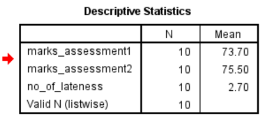

# Mean

For a dataset with values


#### **Purpose of the Mean in Descriptive Statistics**

- In **descriptive statistics**, the **mean** serves as a **measure of central tendency**. 
- It summarizes a set of values by identifying the **"average" or most typical value** in the dataset.


## Practical

- Download the CSV file using the link below:

   [student_assessment_dataset.csv](./mct-datasets/student_assessment_dataset.csv.csv) 

- You should get this table.

  | student_id | firstname | surname | marks_assessment1 | marks_assessment2 | no_of_lateness |
  | ---------- | --------- | ------- | ----------------- | ----------------- | -------------- |
  | 101        | Aarya     | Rao     | 78                | 82                | 2              |
  | 102        | Ben       | Smith   | 65                | 67                | 5              |
  | 103        | Chloe     | Tan     | 89                | 91                | 1              |
  | 104        | Dinesh    | Naidoo  | 72                | 70                | 3              |
  | 105        | Ella      | Brown   | 90                | 88                | 0              |
  | 106        | Farah     | Patel   | 55                | 58                | 6              |
  | 107        | George    | Clark   | 60                | 62                | 4              |
  | 108        | Hema      | Singh   | 83                | 85                | 1              |
  | 109        | Isaac     | Ali     | 77                | 80                | 2              |
  | 110        | Jia       | Lim     | 68                | 72                | 3              |

  #### 

  ***

  #### 🔹 GOAL: Compute Mean (Row-wise)

  ***

  ##### Graphical Method in SPSS:

  - Go to **Transform** > **Compute Variable**

  - In the *Target Variable* box, type: `average_score`

  - Click **Function group** > Select **Statistical**

  - In the *Functions and Special Variables* list, double-click `MEAN`

  - In the parentheses, enter the variables:

  ```SPSS
  average_score = MEAN(marks_assessment1, marks_assessment2)
  ```

  - Click OK

  ##### Syntax Method in SPSS:

  ```SPSS
  COMPUTE average_score = MEAN(marks_assessment1, marks_assessment2).
  EXECUTE.
  ```

  ***

  

  ***

  #### 🔹GOAL: Compute Mean (Column-wise)

  ***

##### Graphical Steps to Get Mean of Each Variable

​		**Open your dataset** in SPSS.

​		Go to **Analyze** → **Descriptive Statistics** → **Descriptives**.

​		In the **Descriptives dialog box**:

​			Select these variables:

​					marks_assessment1

​					marks_assessment2`

​					`no_of_lateness`

​	        Move them to the **Variable(s)** box using the arrow button.

​		Click **Options…**

​		Tick the checkbox for **Mean**

​		(Optionally also select **Standard deviation**, **Minimum**, **Maximum**)

​		Click **Continue**, then **OK**

##### Syntax Method in SPSS

```spss
DESCRIPTIVES VARIABLES=marks_assessment1 marks_assessment2 no_of_lateness 
  /STATISTICS=MEAN.
```

 You will get the following table showing the **mean of each variable**.

`

