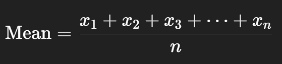
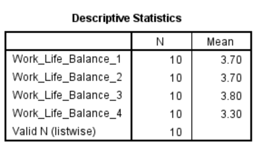

# Mean

For a dataset with values



#### **Purpose of the Mean in Descriptive Statistics**

- In **descriptive statistics**, the **mean** serves as a **measure of central tendency**. 
- It summarizes a set of values by identifying the **"average" or most typical value** in the dataset.


## Practical

- Download the CSV file using the link below:

   [remote_work_mean.csv](.\mct-datasets\remote_work_mean.csv) 

- You should get this table.

  | Respondent_ID | Work_Life_Balance_1 | Work_Life_Balance_2 | Work_Life_Balance_3 | Work_Life_Balance_4 |
  | ------------- | ------------------- | ------------------- | ------------------- | ------------------- |
  | 1             | 4                   | 3                   | 4                   | 3                   |
  | 2             | 3                   | 4                   | 4                   | 3                   |
  | 3             | 5                   | 5                   | 5                   | 4                   |
  | 4             | 4                   | 4                   | 3                   | 4                   |
  | 5             | 2                   | 3                   | 3                   | 2                   |
  | 6             | 4                   | 3                   | 3                   | 3                   |
  | 7             | 3                   | 4                   | 4                   | 3                   |
  | 8             | 5                   | 5                   | 5                   | 5                   |
  | 9             | 4                   | 4                   | 5                   | 4                   |
  | 10            | 3                   | 2                   | 2                   | 2                   |

  #### **Task 1**- To find the mean of each row

  ##### Graphical Method in SPSS:

  - Go to **Transform** > **Compute Variable**

  - In the *Target Variable* box, type: `Mean_WLB`

  - Click **Function group** > Select **Statistical**

  - In the *Functions and Special Variables* list, double-click `MEAN`

  - In the parentheses, enter the variables:

  ```SPSs
  Mean_WLB = MEAN(Work_Life_Balance_1, Work_Life_Balance_2, Work_Life_Balance_3, Work_Life_Balance_4)
  ```

  - Click OK

  ##### Syntax Method in SPSS:

  ```SPSS
  COMPUTE Mean_WLB = MEAN(Work_Life_Balance_1, Work_Life_Balance_2, Work_Life_Balance_3, Work_Life_Balance_4).
  EXECUTE.
  ```

  ***

  #### **Task 2**- To find the mean of each column

  ##### Graphical Method in SPSS:

1. Go to **Analyze** > **Descriptive Statistics** > **Descriptives**
2. Move the following variables to the right panel:
   - `Work_Life_Balance_1`
   - `Work_Life_Balance_2`
   - `Work_Life_Balance_3`
   - `Work_Life_Balance_4`
3. Click **Options** → Make sure **Mean** is ticked (you can also select Std. Deviation, Min, Max)
4. Click **Continue**, then **OK**

##### 	Syntax Method in SPSS

```spss
DESCRIPTIVES VARIABLES=Work_Life_Balance_1 Work_Life_Balance_2 Work_Life_Balance_3 Work_Life_Balance_4
  /STATISTICS=MEAN.
```

 You will get the following table showing the **mean of each variable**.


