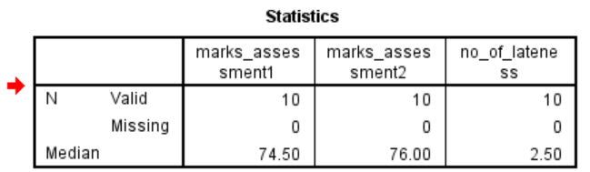

## Median

The **median** is the **middle value** in a dataset when the values are arranged in **ascending** (or descending) order.

### Purpose of Median in Descriptive Statistics

The **median** represents the **50th percentile**, meaning **half** of the data falls below it and half above.

It is **not affected by extreme values** (unlike the mean), so it's useful when data is **skewed** or contains **outliers**.

------

### 🔹 GOAL: Compute Median (Column-wise)

------

#### 🖱️ **Graphical Steps in SPSS to Find the Median**

1. **Open your dataset** in SPSS.
2. Go to **Analyze** → **Descriptive Statistics** → **Frequencies**
3. In the **Frequencies dialog box**:
   - Select the variables:
     - `marks_assessment1`
     - `marks_assessment2`
     - `no_of_lateness`
   - Move them to the **Variable(s)** box.
4. Uncheck “**Display frequency tables**” if you only want statistics.
5. Click **Statistics…**
   - Tick the box for **Median**
   - (Optional: tick Mean, Std. Deviation, Min, Max)
6. Click **Continue**, then **OK**

#### SPSS Syntax to Calculate the Median

```spss
FREQUENCIES VARIABLES=marks_assessment1 marks_assessment2 no_of_lateness
  /STATISTICS=MEDIAN
  /FORMAT=NOTABLE.
```

