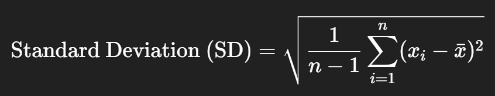

# Standard Deviation

The **standard deviation** is the **square root of the variance**. It measures the **average distance** of each data point from the **mean**.



It is expressed in the **same unit** as the data.

A **low SD** means data is clustered near the mean.

A **high SD** indicates data is more spread out.


***

### Finding Standard Deviation

***

####  **Graphical Steps in SPSS: Compute Standard Deviation**

1. Go to **Analyze** → **Descriptive Statistics** → **Descriptives**
2. Move the variables:
   - `marks_assessment1`
   - `marks_assessment2`
   - `no_of_lateness`
      into the **Variable(s)** box
3. Click **Options…**
   - Tick the checkbox for **Standard Deviation**
   - (Optional: Mean, Variance, Min, Max)
4. Click **Continue**, then **OK**

#### SPSS Syntax to Compute Standard Deviation:

```spss
DESCRIPTIVES VARIABLES=marks_assessment1 marks_assessment2 no_of_lateness
  /STATISTICS=STDDEV.
```

