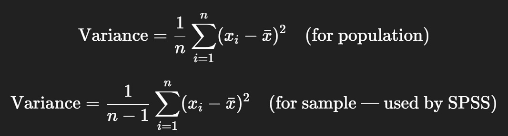

# Variance

The **variance** measures how **spread out** the values in a dataset are from the **mean**.



It is expressed in **squared units**, and it tells you how much the data **deviates from the mean**.


***

### Finding Variance

***

#### **Graphical Steps in SPSS: Compute Variance**

1. Go to **Analyze** → **Descriptive Statistics** → **Descriptives**
2. Move these variables into the **Variable(s)** box:
   - `marks_assessment1`
   - `marks_assessment2`
   - `no_of_lateness`
3. Click **Options...**
4. Tick the checkbox for:
   - **Variance**
   - (Optional: Mean, Std. deviation, Min, Max)
5. Click **Continue**, then **OK**

#### **SPSS Syntax for Variance:**

```spss
DESCRIPTIVES VARIABLES=marks_assessment1 marks_assessment2 no_of_lateness
  /STATISTICS=VARIANCE.
```

