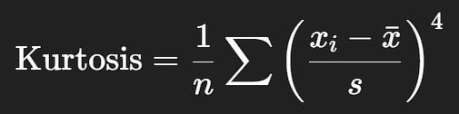

# Kurtosis

**Kurtosis** is a statistical measure that describes the **"tailedness"** or **peakedness** of a distribution compared to a normal distribution.

It tells us how much of the data is in the **tails** and how sharp or flat the **peak** of the distribution is.

#### Mathematical Concept (Simplified)



A **higher exponent (power 4)** than variance makes kurtosis more sensitive to **outliers**.

#### Interpretation of Kurtosis Values

| **Kurtosis Type**       | **Value (Excess Kurtosis)** | **Shape Description**                                       |
| ----------------------- | --------------------------- | ----------------------------------------------------------- |
| **Mesokurtic** (normal) | ≈ 0                         | Bell-shaped, normal distribution                            |
| **Leptokurtic**         | > 0                         | Peaked distribution with **heavy tails** (more outliers)    |
| **Platykurtic**         | < 0                         | Flat-top distribution with **light tails** (fewer outliers) |

### Why It Matters:

- **High kurtosis** = more extreme values than normal (important for risk analysis, quality control)

- **Low kurtosis** = fewer outliers; values more evenly spread

- It's crucial when assessing **normality assumptions** before using **parametric tests** (e.g., regression, ANOVA)

  

***

### Finding Kurtosis

***

Download the dataset:
 [kurtosis_dataset.csv](.././datasets/kurtosis_dataset.csv) 

#### **Graphical Steps in SPSS: Compute Kurtosis**

1. **Open SPSS**, then load `Kurtosis_Example_Dataset.csv`
2. Go to **Analyze** → **Descriptive Statistics** → **Descriptives**
3. Move the variables to the **Variable(s)** box:
   - `normal_kurtosis`
   - `leptokurtic_variable`
   - `platykurtic_variable`
4. Click **Options…**
   - Tick the checkbox for **Kurtosis**
   - (You can also select Mean, Std. deviation, and Skewness for context)
5. Click **Continue**, then **OK**

#### SPSS Syntax

```spss
DESCRIPTIVES VARIABLES=normal_kurtosis leptokurtic_variable platykurtic_variable
  /STATISTICS=KURTOSIS.
```


***

### Visualize with Histograms

***

###### ChatGPT said:

Perfect! Let’s visualize the **kurtosis** of your three variables using **histograms with normal curves** in SPSS.

This will help your students see:

- Which distribution looks **normal (mesokurtic)**
- Which one is **leptokurtic** (tall peak, heavy tails)
- Which one is **platykurtic** (flat peak, light tails)

------

#### Graphical Steps in SPSS: Create Histograms

### For each variable (`normal_kurtosis`, `leptokurtic_variable`, `platykurtic_variable`):

1. Go to **Graphs** → **Legacy Dialogs** → **Histogram**
2. Select **Simple Histogram**, then click **Define**
3. In the dialog box:
   - Move one variable (e.g., `normal_kurtosis`) into the **Variable** box
   - Tick the checkbox **Display normal curve** (important for visual comparison)
4. Click **OK**

Repeat for the other two variables:

- `leptokurtic_variable`
- `platykurtic_variable`

#### SPSS Syntax

```spss
GRAPH
  /HISTOGRAM=normal_kurtosis
  /TITLE='Histogram - Normal Kurtosis (Mesokurtic)'.

GRAPH
  /HISTOGRAM=leptokurtic_variable
  /TITLE='Histogram - Leptokurtic (Peaked)'.

GRAPH
  /HISTOGRAM=platykurtic_variable
  /TITLE='Histogram - Platykurtic (Flat)'.

```

SPSS will generate **3 histograms**, each with a **normal curve overlay**. You’ll clearly see the differences in:

- **Peak height**
- **Tail thickness**
- **Shape symmetry**