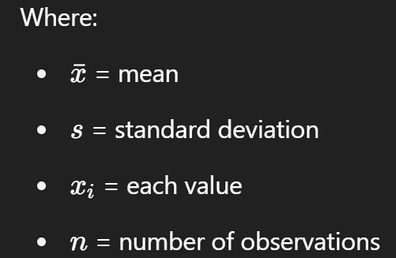

# Skewness

**Skewness** is a measure of the **asymmetry** of the distribution of values in a dataset.

| Type                | Description                                                  |
| ------------------- | ------------------------------------------------------------ |
| `Normal`            | Symmetrical — data is evenly distributed around the mean     |
| `Positively skew`ed | Tail extends to the **right** — more low values, a few high outliers |
| `Negatively skew`ed | Tail extends to the **left** — more high values, a few low outliers |




####  **Interpretation**

| Skewness Value | Interpretation                   |
| -------------- | -------------------------------- |
| ≈ 0            | Symmetric (Normal)               |
| > 0            | Positively Skewed (Right-skewed) |
| < 0            | Negatively Skewed (Left-skewed)  |

### **Why It Matters:**

In MBA research, skewness helps you:

- Assess if your **data meets normality assumptions** (important for t-tests, ANOVA, regression).
- Choose between **parametric** and **non-parametric** statistical tests.


***

### Compute Skewness

***

Download the dataset:
 [skewness_dataset.csv](../../datasets/skewness_dataset.csv) 

## **Graphical Steps in SPSS: Compute Skewness**

1. Open your file `Skewness_Example_Dataset.csv` in SPSS.
2. Go to **Analyze** → **Descriptive Statistics** → **Descriptives**
3. Move these variables to the **Variable(s)** box:
   - `normal_variable`
   - `positive_skew_variable`
   - `negative_skew_variable`
4. Click **Options…**
5. Tick the box for **Skewness**
6. Click **Continue**, then **OK**

####  **SPSS Syntax to Compute Skewness**

```spss
DESCRIPTIVES VARIABLES=normal_variable positive_skew_variable negative_skew_variable
  /STATISTICS=MEAN STDDEV SKEWNESS.
```


***

### Visualize Skewness Using Histograms

***

#### Graphical Steps in SPSS

##### For each variable (`normal_variable`, `positive_skew_variable`, `negative_skew_variable`):

1. Go to **Graphs** → **Legacy Dialogs** → **Histogram**
2. In the **Histogram dialog**:
   - Move one variable at a time (e.g., `normal_variable`) into the **Variable** box
   - (Optional) Tick **Display normal curve** to overlay a normal distribution
3. Click **OK**

Repeat the steps for the other two variables:

- `positive_skew_variable`
- `negative_skew_variable`

#### SPSS Syntax

```spss
GRAPH
  /HISTOGRAM=normal_variable
  /TITLE='Histogram of Normal Variable'.

GRAPH
  /HISTOGRAM=positive_skew_variable
  /TITLE='Histogram of Positively Skewed Variable'.

GRAPH
  /HISTOGRAM=negative_skew_variable
  /TITLE='Histogram of Negatively Skewed Variable'.
```

