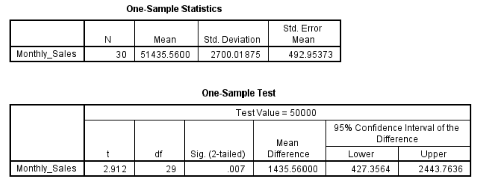

# One-Sample-T-Test

A **one-sample t-test** determines whether the **mean of a single sample** is significantly different from a **known or hypothesized population mean**.

### **Purpose of the Test:**

To test if the performance, satisfaction, cost, or any other business metric is **statistically different** from a predefined standard or benchmark.

### **Relevance to an MBA Dissertation:**

- In MBA research, it's common to:
  - Benchmark company performance
  - Test operational targets
  - Compare employee KPIs to industry norms
-  E.g., testing whether **average customer satisfaction**, **monthly sales**, or **employee productivity** meets business targets.

### **Case Study (MBA Context):**

**Are XYZ Ltd.’s Sales Employees Performing Above the Industry Standard?**

XYZ Ltd. wants to evaluate whether its employees are **outperforming the national sales benchmark** of **Rs 50,000/month**.

### **Hypotheses:**

- **Null Hypothesis (H₀):**
   The average monthly sales of XYZ Ltd. employees is **equal to Rs 50,000**.
  $$
  H_0: \mu = 50000
  $$

- **Alternative Hypothesis (H₁):**
   The average monthly sales of XYZ Ltd. employees is **not equal to Rs 50,000**.
  $$
  H_1: \mu \ne 50000
  $$

### Dataset

 [one_sample_t_test_dataset.csv](../../datasets/one_sample_t_test_dataset.csv) 

**Variables:**

- `Employee_ID`
- `Monthly_Sales` (in Rs)

#### **Graphical Steps in SPSS:**

1. Open the dataset in SPSS.
2. Go to **Analyze** → **Compare Means** → **One-Sample T Test**
3. Move `Monthly_Sales` to the **Test Variable(s)** box.
4. In the **Test Value** field, enter `50000`.
5. Click **OK**

Output includes: Mean difference, t-value, degrees of freedom (df), and Sig. (2-tailed)

#### SPSS Syntax:

```spss
T-TEST
  /TESTVAL=50000
  /MISSING=ANALYSIS
  /VARIABLES=Monthly_Sales
  /CRITERIA=CI(.95).
```

#### Results



#### **Result Recap**

| Metric                       | Value             |
| ---------------------------- | ----------------- |
| Sample Size (n)              | 30                |
| Sample Mean                  | Rs 51,435.56      |
| Test Value (Population Mean) | Rs 50,000         |
| t-value                      | 2.912             |
| Degrees of Freedom (df)      | 29                |
| Sig. (2-tailed)              | 0.007             |
| 95% CI of Difference         | [427.36, 2443.76] |

#### **Interpretation**

The one-sample t-test was conducted to determine whether the average monthly sales of employees at XYZ Ltd. is significantly different from the industry benchmark of Rs 50,000.

The results indicate that the sample mean (M = Rs 51,435.56, SD = Rs 2,700.02) is **significantly higher** than the industry standard,
$$
t(29) = 2.912,\ p = 0.007
$$
Since **p < 0.05**, we **reject the null hypothesis** and conclude that there is **a statistically significant difference** between the company’s average monthly sales and the industry benchmark. The 95% confidence interval [427.36, 2443.76] confirms that the true mean difference is positive.

#### **Business Value Discussion**

This result has **strong strategic implications** for XYZ Ltd.:

- The sales team is **outperforming** the industry standard.
- This may support decisions around:
  - **Performance bonuses**
  - **Retention strategies**
  - **Brand positioning** ("Industry-leading performance")

Additionally, this can be leveraged in **investor presentations** and **benchmarking reports** to showcase the company’s operational excellence.

## **Conclusion**

The one-sample t-test reveals that XYZ Ltd.’s sales employees generate significantly higher monthly sales than the Rs 50,000 industry average. This statistically significant finding validates internal strategies and supports confidence in sales team performance. XYZ Ltd. can use this insight for data-driven decisions in HR, operations, and strategic planning.