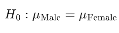
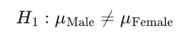
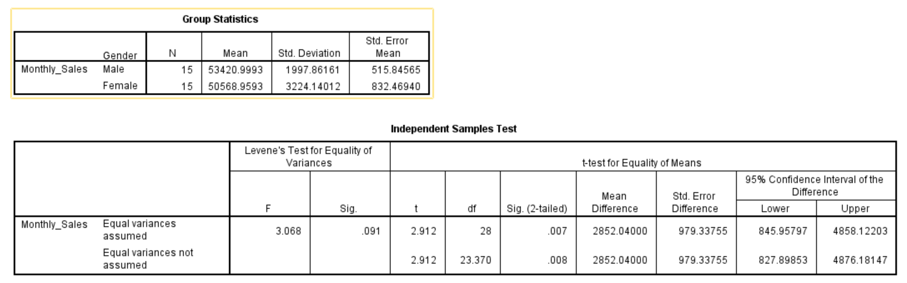

# Independent Samples t Test

> An **independent samples t-test** compares the **means of two unrelated (independent) groups** to determine if there's a **statistically significant difference** between them.
>

### **Purpose of the Test:**

To test whether **two distinct groups** (e.g., males vs. females, trained vs. untrained staff) differ in terms of a **continuous variable** (e.g., sales, performance, satisfaction).

### **Relevance to an MBA Dissertation:**

This test is widely used to:

- Compare **two departments**, **locations**, or **teams**
- Assess **gender-based differences** in productivity or earnings
- Evaluate the effect of **interventions** (e.g., training vs. no training)

##  **Case Study:**

### 🧾 Title:

**Do Male and Female Employees at XYZ Ltd. Differ in Their Monthly Sales Performance?**

XYZ Ltd. wants to assess whether there's a significant difference in monthly sales between **male** and **female** sales employees.

##  **Hypotheses:**

- **Null Hypothesis (H₀):**
   There is **no significant difference** in average monthly sales between male and female employees.

  

- **Alternative Hypothesis (H₁):**
   There **is a significant difference** in average monthly sales between male and female employees.



####  **Dataset:**

 [independent_sample_t_test_dataset.csv](../../datasets/independent_sample_t_test_dataset.csv) 

**Variables:**

- `Employee_ID`
- `Gender` (Male/Female)
- `Monthly_Sales` (Rs)

#### **Graphical Steps in SPSS:**

1. Open the dataset in SPSS.
2. Go to **Analyze** → **Compare Means** → **Independent-Samples T Test**
3. Move `Monthly_Sales` to the **Test Variable(s)** box.
4. Move `Gender` to the **Grouping Variable** box.
5. Click **Define Groups** and type:
   - Group 1: `Male`
   - Group 2: `Female`
6. Click **Continue**, then **OK**

SPSS will output **Levene’s Test**, **t-test statistics**, **mean difference**, and **confidence interval**.

####  **SPSS Syntax:**

```spss
T-TEST GROUPS=Gender('Male' 'Female')
  /VARIABLES=Monthly_Sales
  /CRITERIA=CI(.95).
```

#### **Results**



#### SPSS Output Summary

| Metric                 | Value                                      |
| ---------------------- | ------------------------------------------ |
| Sample Size (Male/Fem) | 15 / 15                                    |
| Mean (Male)            | Rs 53,420.99                               |
| Mean (Female)          | Rs 50,568.96                               |
| Mean Difference        | Rs 2,852.04                                |
| Levene's Test Sig.     | 0.091 *(> 0.05 → Equal variances assumed)* |
| t-value                | 2.912                                      |
| df                     | 28                                         |
| Sig. (2-tailed)        | 0.007 *(< 0.05 → Significant)*             |
| 95% CI of Difference   | [Rs 845.96, Rs 4,858.12]                   |

## **Interpretation (MBA Level)**

An independent samples t-test was performed to compare the average monthly sales of male and female employees at XYZ Ltd.

The mean monthly sales for male employees (M = Rs 53,420.99, SD = Rs 1,997.86) was significantly higher than that of female employees (M = Rs 50,568.96, SD = Rs 3,224.14),

t(28) = 2.912, p = 0.007

Since **p < 0.05**, we **reject the null hypothesis** and conclude that **there is a statistically significant difference** in monthly sales between male and female employees.

### **Business Value Discussion**

This result has key implications for management and HR policy:

- **Gender-Based Performance Insight**: The statistically significant difference suggests that male employees currently **outperform female employees** in monthly sales figures.
- **Workplace Strategy**: This may warrant deeper exploration into:
  - Training or mentoring opportunities for female staff
  - Review of product assignments or territory distribution
- **Equity vs. Performance**: Important not to jump to causal conclusions — further investigation into **underlying factors** (e.g., tenure, team structure) is advisable.

In HR-driven MBA projects, such insights support **evidence-based management**.

## **Conclusion**

The independent samples t-test provides evidence that male employees at XYZ Ltd. have significantly higher monthly sales than their female counterparts. This finding is statistically significant and may indicate a performance gap worth exploring in future HR and sales strategy decisions.