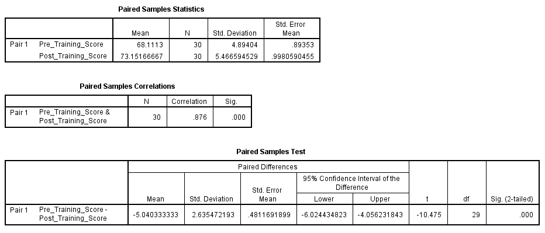

# **Paired Samples T Test**

> A **paired samples t-test** (also called dependent t-test) is used to compare **two related means** — usually **before and after** a treatment or intervention — to see if there’s a statistically significant change.

## **Purpose of the Test:**

To determine whether a **single group** shows **significant improvement or decline** across two time points, conditions, or metrics.

## **Relevance to an MBA Dissertation:**

Very useful in:

- **HR/Training**: Before-and-after scores from training programs
- **Marketing**: Pre- and post-campaign brand awareness
- **Operations**: Performance before and after system changes

## **Case Study:**

### Title:

**Does Sales Training Improve Employee Knowledge Scores?**

XYZ Ltd. conducted a training session for 30 employees and wants to know if the training **significantly improved knowledge**.

## **Hypotheses:**

- **Null Hypothesis (H₀):**
   There is **no significant difference** in employee scores before and after training.

  

- **Alternative Hypothesis (H₁):**
   There **is a significant difference** in scores before and after training.


This is a **two-tailed** test.

#### Dataset:

 [paired_samples_t_test.csv](../../datasets/paired_samples_t_test.csv) 

#### **Graphical Steps in SPSS:**

1. Open the dataset in SPSS.
2. Go to **Analyze** → **Compare Means** → **Paired-Samples T Test**
3. Select:
   - `Pre_Training_Score` → **Variable 1**
   - `Post_Training_Score` → **Variable 2**
4. Click **OK**

SPSS will return:

- Paired samples statistics
- Correlation between the two sets
- t-value, df, p-value

#### SPSS Syntax:

```spss
T-TEST PAIRS=Pre_Training_Score WITH Post_Training_Score (PAIRED)
  /CRITERIA=CI(.95).
```

#### Results



 **SPSS Output Summary**

| Metric                        | Value              |
| ----------------------------- | ------------------ |
| Mean (Pre-Training)           | 68.11              |
| Mean (Post-Training)          | 73.15              |
| Mean Difference               | -5.04              |
| Std. Deviation of Differences | 2.64               |
| t-value                       | -10.475            |
| df                            | 29                 |
| Sig. (2-tailed)               | 0.000              |
| 95% CI of Difference          | [-6.02, -4.06]     |
| Correlation (Pre vs Post)     | 0.876 (**strong**) |

Note: Negative mean difference indicates **Post > Pre**, since difference = Pre − Post.

### **Interpretation**

A **paired samples t-test** was conducted to evaluate the effectiveness of a training program on employee knowledge scores at XYZ Ltd.

The results show a **significant increase** in post-training scores (M = 73.15, SD = 5.47) compared to pre-training scores (M = 68.11, SD = 4.89).
$$
t(29) = -10.475,\ p < .001
$$
Because the **p-value is less than 0.05**, we **reject the null hypothesis** and conclude that there is a **statistically significant improvement** in employee scores following the training.

The 95% confidence interval for the mean difference [-6.02, -4.06] suggests the average improvement was between **4 to 6 points**.

## **Business Value Discussion**

This test validates that the **training program was effective**, leading to measurable improvement in employee knowledge:

- **Data-driven justification** for continued investment in employee training
- Can be used to **quantify ROI** on human capital development
- Enhances internal credibility and supports **HR policy planning**
- High correlation (r = .876) suggests **strong consistency** between pre and post measurements

Such statistical evidence strengthens the case for integrating **training KPIs** into performance reviews or appraisal models.

## **Conclusion**

The paired samples t-test confirms that the training program at XYZ Ltd. led to a **statistically significant improvement** in employee knowledge scores. The business should recognize the training's impact and consider further reinforcement or scaling strategies based on this success.

