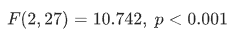

# One-Way Anova

> **One-Way ANOVA (Analysis of Variance)** is a statistical test used to determine whether there are **significant differences in the means** of **three or more independent groups**.

## **Purpose of the Test:**

To test whether a **categorical independent variable** (e.g., department) affects a **continuous dependent variable** (e.g., performance score).

## **Relevance to an MBA Dissertation:**

One-Way ANOVA is frequently used in:

- **HR analytics**: Comparing performance across departments
- **Marketing**: Comparing customer satisfaction across regions
- **Finance**: Comparing cost savings from different strategies

- **Null Hypothesis (H₀):**
   There is **no significant difference** in mean performance scores across departments.

  

- **Alternative Hypothesis (H₁):**
   At least **one department’s mean** performance score is **different** from the others.

  

#### Dataset:

  [one_way_anova.csv](../../datasets/one_way_anova.csv) 

| **Column Name**     | **Description**                       |
| ------------------- | ------------------------------------- |
| `Employee_ID`       | Unique identifier                     |
| `Department_Code`   | 1 = Sales, 2 = Marketing, 3 = Finance |
| `Performance_Score` | Numeric performance score             |

## **Graphical Steps in SPSS:**

1. Open the dataset in SPSS.
2. Go to **Analyze** → **Compare Means** → **One-Way ANOVA**
3. Move `Performance_Score` into the **Dependent List** box.
4. Move `Department_Code` into the **Factor** box.
5. Click **Options…**
   - Tick **Descriptive** and optionally **Homogeneity of variance test**
6. Click **Continue**, then **OK**

 SPSS will return:

- ANOVA table (F-statistic, Sig.)
- Group means
- (Optional) post hoc test if needed

#### SPSS Syntax:

```spss
ONEWAY Performance_Score BY Department_Code
  /STATISTICS DESCRIPTIVES
  /MISSING ANALYSIS.
```

### Results


## **SPSS Output Summary**

### Group Means:

| Department_Code  | Mean Performance Score |
| ---------------- | ---------------------- |
| 1 (Sales)        | 76.78                  |
| 2 (Marketing)    | 72.42                  |
| 3 (Finance)      | 65.31                  |
| **Overall Mean** | 71.50                  |


###  ANOVA Table:

| Statistic            | Value  |
| -------------------- | ------ |
| F-value              | 10.742 |
| df (between, within) | 2, 27  |
| Sig. (p-value)       | 0.000  |

## **Interpretation**

A **one-way ANOVA** was conducted to determine whether there are significant differences in **employee performance scores** across **three departments**: Sales, Marketing, and Finance.

The analysis revealed a **statistically significant difference** in performance scores,



Since the p-value is **less than 0.05**, we **reject the null hypothesis**. This indicates that **at least one department’s average performance is significantly different** from the others.

The descriptive statistics show:

- **Sales** had the highest average score (76.78)
- **Finance** had the lowest (65.31)

However, to determine **which departments differ**, a **post-hoc test** (e.g., Tukey's HSD) would be required.

## **Business Value Discussion**

This ANOVA result provides valuable insight for XYZ Ltd.:

- **Performance Gap Identified**: Sales employees are **outperforming** their counterparts in Finance and Marketing.
- **Strategic Implications**:
  - Investigate the **drivers of success** in the Sales department (e.g., tools, leadership, motivation)
  - Consider **training** or **resource reallocation** for underperforming departments
- **Data-Driven HR**: Enables performance appraisal systems to be **customized** by department performance norms.

Such insights can influence **bonus allocation**, **employee development programs**, and **inter-departmental benchmarking**.

## **Conclusion**

The one-way ANOVA analysis revealed **significant differences** in employee performance across departments at XYZ Ltd. With Sales performing best and Finance the lowest, the findings can guide **performance improvement strategies** and **targeted interventions** across teams.