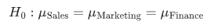
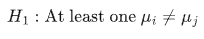

# One-Way Anova

> **One-Way ANOVA (Analysis of Variance)** is a statistical test used to determine whether there are **significant differences in the means** of **three or more independent groups**.

## **Purpose of the Test:**

To test whether a **categorical independent variable** (e.g., department) affects a **continuous dependent variable** (e.g., performance score).

## **Relevance to an MBA Dissertation:**

One-Way ANOVA is frequently used in:

- **HR analytics**: Comparing performance across departments
- **Marketing**: Comparing customer satisfaction across regions
- **Finance**: Comparing cost savings from different strategies

- **Null Hypothesis (H₀):**
   There is **no significant difference** in mean performance scores across departments.

  

- **Alternative Hypothesis (H₁):**
   At least **one department’s mean** performance score is **different** from the others.

  