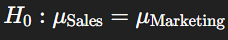
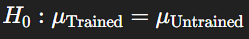
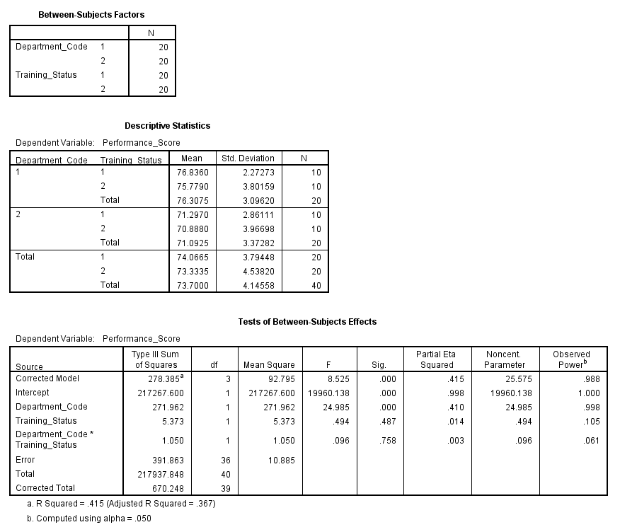
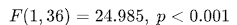
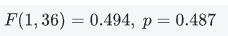
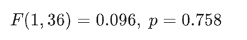

# Factorial between Groups Anova

> A **Factorial ANOVA** is used when there are **two or more independent categorical variables (factors)** and **one continuous dependent variable**. It tests for:
>
> 1. **Main effects** of each factor
> 2. **Interaction effect** between the factors


## **Purpose of the Test:**

To understand:

- How **each independent variable affects** the outcome
- Whether the **effect of one variable depends** on the level of another


## **Relevance to an MBA Dissertation:**

This is ideal for:

- HR: Testing how **department** and **training status** affect **employee performance**
- Marketing: Examining how **region** and **advertisement type** affect **sales response**
- Finance: Assessing how **investment type** and **market condition** affect **returns**


## **Case Study:**

### 🧾 Title:

**How Do Department and Training Status Affect Employee Performance at XYZ Ltd.?**

XYZ Ltd. wants to assess whether employee performance varies by:

- **Department** (Sales vs. Marketing)
- **Training Status** (Trained vs. Untrained)
- And whether the **effect of training differs by department**


## **Hypotheses:**

- **Main Effect (Department):**

  

- **Main Effect (Training):**
   

- **Interaction Effect:**
  H0:No interaction between Department and Training

#### Dataset

 [factorial_anova_performance.csv](../../datasets/factorial_anova_performance.csv) 

**Variables:**

- `Employee_ID`
- `Department_Code`: 1 = Sales, 2 = Marketing
- `Training_Status`: 1 = Trained, 2 = Untrained
- `Performance_Score`

## **Graphical Steps in SPSS:**

1. Open the dataset in SPSS
2. Go to **Analyze** → **General Linear Model** → **Univariate**
3. Move:
   - `Performance_Score` → **Dependent Variable**
   - `Department_Code` and `Training_Status` → **Fixed Factors**
4. Click **Options…**
   - Move both main effects and interaction into “Display Means for”
   - Tick **Compare main effects** → choose **Bonferroni** (optional)
5. Click **Continue**, then **OK**

✅ SPSS will produce:

- Main effect tests
- Interaction effect
- Descriptive stats

## **SPSS Syntax:**

```spss
UNIANOVA Performance_Score BY Department_Code Training_Status
  /METHOD=SSTYPE(3)
  /INTERCEPT=INCLUDE
  /PRINT=DESCRIPTIVE ETASQ OPOWER
  /DESIGN=Department_Code Training_Status Department_Code*Training_Status.
```

Results



------

## ✅ **SPSS Output Summary**

### 📊 **Descriptive Means**:

| Department       | Training      | Mean Score |
| ---------------- | ------------- | ---------- |
| Sales (1)        | Trained (1)   | 76.84      |
| Sales (1)        | Untrained (2) | 75.78      |
| Marketing (2)    | Trained (1)   | 71.30      |
| Marketing (2)    | Untrained (2) | 70.89      |
| **Overall Mean** |               | 73.70      |

### 🧪 **Tests of Between-Subjects Effects**:

| Source                                 | F     | Sig. (p) | Interpretation               |
| -------------------------------------- | ----- | -------- | ---------------------------- |
| **Department_Code**                    | 24.99 | 0.000    | ✅ Significant main effect    |
| **Training_Status**                    | 0.494 | 0.487    | ❌ Not significant            |
| **Department \* Training Interaction** | 0.096 | 0.758    | ❌ No significant interaction |

## **Interpretation (MBA Level)**

A **2x2 factorial ANOVA** was conducted to examine the effects of **department (Sales vs. Marketing)** and **training status (Trained vs. Untrained)** on employee performance scores.

- **Department** had a **statistically significant main effect** on performance scores,

- 

  indicating that employees from different departments performed significantly differently, regardless of training.

- **Training Status** did **not have a significant effect**,

- 

  suggesting training (as delivered here) did not substantially change scores.

- There was **no significant interaction** between department and training status,

- 

  meaning the effect of training did not vary by department.

## **Business Value Discussion**

This factorial ANOVA provides actionable insights for XYZ Ltd.:

- **Departmental Performance**: Sales employees consistently outperform Marketing employees. This may be due to differences in job design, resource availability, or team dynamics.
- **Training Evaluation**: The current training appears **ineffective** in improving performance — possibly due to content misalignment or implementation issues.
- **No Interaction**: The impact of training is **not department-dependent**, suggesting a **generic** effect across departments — or a uniformly weak one.

This data should inform:

- **Department-specific strategies**
- A **review of the training curriculum**
- More **targeted interventions** for underperforming teams

## **Conclusion**

The factorial ANOVA revealed that **department** plays a significant role in employee performance at XYZ Ltd., while the **training program did not show significant impact**, and **no interaction** was observed. These results suggest that future performance improvement efforts should focus more on **departmental restructuring and training program enhancement**.