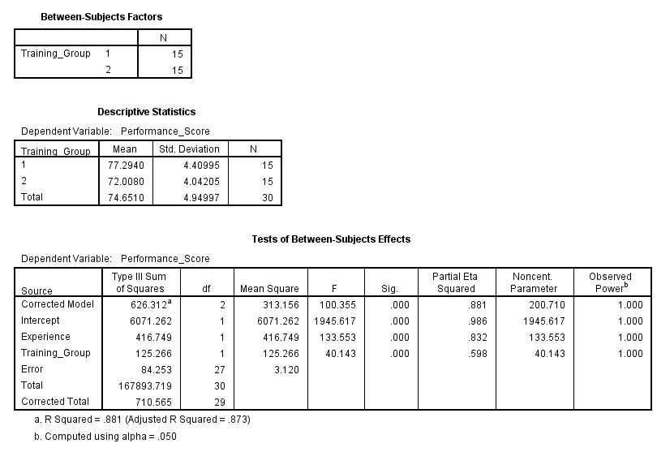
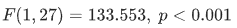
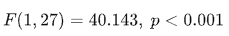

# Ancova

> **ANCOVA** is a statistical test that examines whether the means of a **dependent variable** differ across groups (like ANOVA) **while controlling for the effect of one or more covariates** (continuous variables that might influence the outcome).

## **Purpose of the Test:**

To remove the influence of a **confounding variable** (covariate) when comparing **group means** — making the group comparison **fairer and more accurate**.

## **Relevance to an MBA Dissertation:**

- In **training evaluations**, account for **prior experience** when measuring training impact
- In **sales performance**, control for **years in the company** when comparing regions
- In **marketing**, control for **budget spent** when comparing campaign outcomes

## **Case Study:**

### 🧾 Title:

**Does Training Improve Employee Performance After Controlling for Experience?**

XYZ Ltd. wants to assess whether a training program improves performance, while adjusting for **employee experience** (in years), which is known to affect performance.

## **Hypotheses:**

- **Null Hypothesis (H₀):**
   There is **no significant difference** in performance scores between trained and untrained employees after controlling for experience.
- **Alternative Hypothesis (H₁):**
   There **is a significant difference** in performance after controlling for experience.

### Dataset

 [ancova_training_performance.csv](../../datasets/ancova_training_performance.csv) 

**Variables:**

- `Employee_ID`
- `Training_Group` (1 = Trained, 2 = Untrained)
- `Experience` (years)
- `Performance_Score`

### **Graphical Steps in SPSS:**

1. Open the dataset in SPSS
2. Go to **Analyze** → **General Linear Model** → **Univariate**
3. Set:
   - **Dependent Variable**: `Performance_Score`
   - **Fixed Factor**: `Training_Group`
   - **Covariate**: `Experience`
4. Click **Options…**
   - Move `Training_Group` to “Display Means for”
   - Tick **Compare main effects**
5. Click **Continue**, then **OK**

✅ SPSS will return:

- Significance of the training group (after controlling for experience)
- Significance of the covariate (experience)

### SPSS Syntax:

```spss
UNIANOVA Performance_Score BY Training_Group WITH Experience
  /METHOD=SSTYPE(3)
  /INTERCEPT=INCLUDE
  /PRINT=DESCRIPTIVE ETASQ OPOWER
  /DESIGN=Experience Training_Group.
```

### Results



## **SPSS Output Summary**

| Effect             | F       | Sig. (p-value) | Partial Eta Squared | Interpretation                                      |
| ------------------ | ------- | -------------- | ------------------- | --------------------------------------------------- |
| **Experience**     | 133.553 | 0.000          | 0.832               | ✅ Significant covariate                             |
| **Training_Group** | 40.143  | 0.000          | 0.598               | ✅ Significant effect after adjusting for Experience |

##  **Interpretation**

An **ANCOVA** was conducted to examine whether training has a significant effect on employee performance after controlling for years of experience.

- The covariate **Experience** had a **significant effect** on performance:

  

  indicating that employees with more experience tend to score higher, as expected.

- Even after adjusting for Experience, **Training_Group** still showed a **statistically significant effect** on performance:

  

  suggesting that training provides **additional performance benefits** beyond experience.

The **partial eta squared** values (.832 for experience and .598 for training) show **large effect sizes**, confirming practical significance.

## **Business Value Discussion**

This ANCOVA provides compelling evidence to support **investment in structured training**:

- **Training works**, even for experienced employees — it adds independent value.
- Managers and HR leaders can use this to justify:
  - Scaling the training program across departments
  - Allocating budgets toward structured onboarding and upskilling
- **Experience alone is not enough** — training provides measurable gains on top of tenure

This supports a **data-driven learning and development strategy** at XYZ Ltd., where both tenure and targeted training are leveraged to maximize performance.

## **Conclusion**

The ANCOVA confirmed that both **training** and **employee experience** significantly influence performance at XYZ Ltd. Notably, training remains a **valuable predictor** of performance even after adjusting for experience, making it a strategic asset for workforce development.