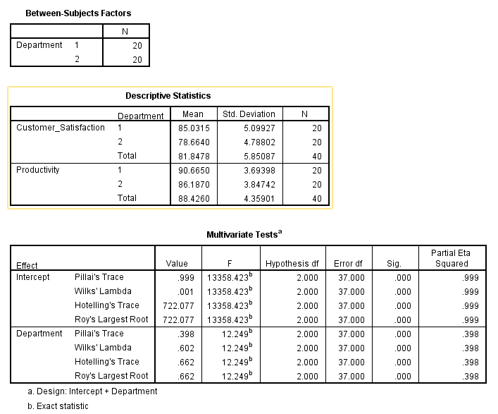

# MANOVA (Multivariate Analysis of Variance)

> **MANOVA** is an extension of ANOVA that allows you to test whether **multiple dependent variables** differ across **two or more groups**. It considers the **combined effect** of the dependent variables and identifies whether group membership significantly influences the outcome profile.

## **Purpose of the Test:**

To test **group differences** when you have **more than one dependent variable**, while accounting for the potential **correlation between them**.

## **Relevance to an MBA Dissertation:**

- **HR**: Does department affect **both job satisfaction and productivity**?
- **Marketing**: Does region affect **brand awareness and customer retention**?
- **Operations**: Does service model impact both **cost efficiency and quality score**?

## **Case Study:**

### 🧾 Title:

**Do Departments Differ in Customer Satisfaction and Productivity at XYZ Ltd.?**

XYZ Ltd. wants to assess whether **Sales** and **Marketing** departments differ significantly in both **customer satisfaction** and **employee productivity**.

## **Hypotheses:**

- **Null Hypothesis (H₀):**
   There is **no multivariate difference** between departments across both outcome variables.
- **Alternative Hypothesis (H₁):**
   There **is a multivariate difference** between departments in customer satisfaction and productivity.

### Dataset

 [manova_department_performance.csv](../../datasets/manova_department_performance.csv) 

**Variables:**

- `Employee_ID`
- `Department` (1 = Sales, 2 = Marketing)
- `Customer_Satisfaction`
- `Productivity`

## **Graphical Steps in SPSS:**

1. Open the dataset in SPSS.
2. Go to **Analyze** → **General Linear Model** → **Multivariate**
3. Move:
   - `Customer_Satisfaction` and `Productivity` → **Dependent Variables**
   - `Department` → **Fixed Factor**
4. Click **Options…**
   - Move `Department` into “Display Means for”
   - Tick **Compare main effects** if desired
5. Click **Continue**, then **OK**

✅ SPSS will display:

- **Multivariate Tests Table** (Wilks’ Lambda, Pillai’s Trace, etc.)
- **Between-subjects effects** for each DV

###  **SPSS Syntax:**

```spss
GLM Customer_Satisfaction Productivity BY Department
  /METHOD=SSTYPE(3)
  /INTERCEPT=INCLUDE
  /PRINT=DESCRIPTIVE ETASQ
  /CRITERIA=ALPHA(.05)
  /DESIGN=Department.
```

### Results




## **SPSS Output Summary**

### 📊 **Descriptive Means**:

| Department    | Customer Satisfaction | Productivity |
| ------------- | --------------------- | ------------ |
| Sales (1)     | 85.03                 | 90.67        |
| Marketing (2) | 78.66                 | 86.19        |
| **Total**     | 81.85                 | 88.43        |

###  **Multivariate Test Results (Effect of Department):**

| Test           | F     | Sig. (p) | Partial Eta² |
| -------------- | ----- | -------- | ------------ |
| Wilks’ Lambda  | 0.602 | 0.000    | 0.398        |
| Pillai’s Trace | 0.398 | 0.000    | 0.398        |


✅ **Significant multivariate effect** of department on the combined DV set.

### **Univariate ANOVA (Between-Subjects Effects):**

| Dependent Variable    | F      | Sig. (p) | Partial Eta² |
| --------------------- | ------ | -------- | ------------ |
| Customer Satisfaction | 16.573 | 0.000    | 0.304        |
| Productivity          | 14.098 | 0.001    | 0.271        |


✅ **Significant differences** between departments for both outcomes individually.

## **Interpretation**

A **MANOVA** was conducted to determine whether department (Sales vs. Marketing) had a statistically significant effect on **both customer satisfaction** and **employee productivity** simultaneously.

- The multivariate tests (Wilks’ Lambda and Pillai’s Trace) showed a **statistically significant difference** between departments,
- 
- Follow-up univariate ANOVAs revealed that:
  - **Customer satisfaction** was significantly higher in the Sales department
  - 
  - **Productivity** was also significantly higher in the Sales department
  - 

Partial Eta Squared values (0.304 and 0.271) suggest **moderate to large effect sizes**, indicating practical as well as statistical significance.

##  **Business Value Discussion**

This MANOVA analysis provides powerful, multi-dimensional insights:

- The **Sales department is outperforming Marketing** in both customer satisfaction and productivity.
- Suggests that **Sales may have better systems, leadership, or training** — worth investigating for best practices.
- Marketing may benefit from:
  - **Process audits**
  - **Skill development initiatives**
  - **Closer alignment with customer expectations**

These results support **evidence-based restructuring**, **resource allocation**, or **performance incentive strategies**.

## **Conclusion**

The MANOVA revealed that **departmental membership significantly affects employee performance** across two critical business outcomes: customer satisfaction and productivity. Sales outperforms Marketing on both fronts. The findings offer clear direction for strategic HR and operational decisions to enhance cross-departmental performance.